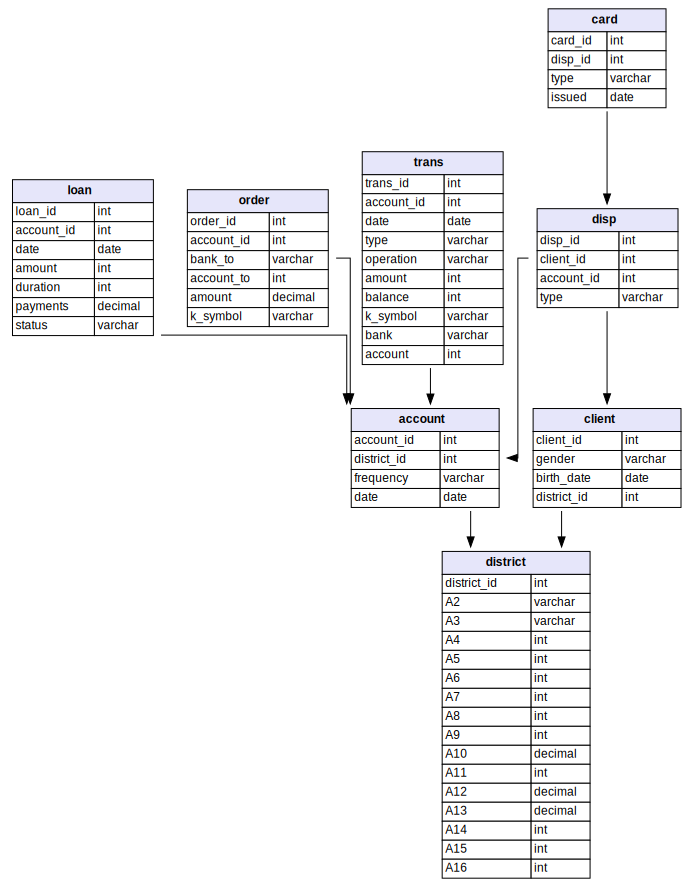

# DM1 - FCUP

A bank is aiming to enhance its customer service quality. One particular challenge it faces is the ambiguity surrounding the identification of good clients (those eligible for additional services) and bad clients (those requiring close monitoring to mitigate potential losses). The bank stores data of its clients, including information on their accounts (comprising transactions spanning several months), previously granted loans, and issued credit cards.

This project aims to use data mining techniques on this data set to help bank managers better understand their clients and identify which type of client makes a good candidate for a credit card.

## Task 1: Data Understanding and Preparation
This task involves summarizing and visualizing the data to provide valuable insights. Consider questions that could be interesting to check with the available data and provide answers using textual summaries or data visualization. Based on this analysis, you should also check if it is necessary to carry out any data clean-up and pre-processing steps.

## Task 2: Descriptive Modelling
This task aims to apply a clustering algorithm on a set of variables that you find helpful to provide some description of the type of clients. 

## Task 3: Predictive Modelling
From the available data, you should define the data set used for the classification task at hand. Different models should be considered, and the choice of the final model should be justified. 

## Task 4: Kaggle Competition
Additionally, you should submit your solution for the data set available in the Kaggle Competition - open on November 7th. Your private rank will be accounted for in the final grade. 

### Dataset
